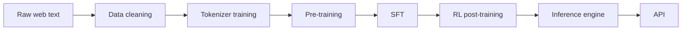

# Curriculum Overview

This curriculum walks through every stage of building a large language model from scratch — from raw internet text to a deployed, instruction-following model served behind an API. Each chapter is both a design document and an implementation guide: it explains *why* each decision was made, not just *what* was built.

## The full pipeline

## Chapters

| # | Chapter | What you learn |
|---|---|---|
| 1 | [Dataset selection](01_dataset.md) | How to choose and obtain a pretraining corpus; quality filtering tradeoffs |
| 2 | [Data cleaning](02_data_cleaning.md) | Deduplication, quality scoring, format normalisation |
| 3 | [Tokenizer training](03_tokenizer.md) | ByteLevel BPE from scratch; vocabulary size tradeoffs; special tokens; chat templates |
| 4 | [Model architecture](04_architecture.md) | Transformer anatomy: RMSNorm, GQA, SwiGLU, RoPE; HF adapter pattern |
| 5 | [Pre-training](05_pretraining.md) | Training loop, LR scheduling, mixed precision, checkpointing, distributed training |
| 6 | [SFT](06_sft.md) | Instruction tuning with TRL; dataset format; loss masking; what SFT can and cannot fix |
| 7 | [RL post-training](07_rl.md) | DPO, GRPO, and PPO; offline vs online RL; reward modelling |
| 8 | [Inference engine](08_inference.md) | Paged KV cache, continuous batching, disaggregated prefill-decode, NCCL TP, Triton kernels |

## Design principles

**Simplicity over peak performance.** Every component is written to be read and modified, not just run. The target is ~50% of industry throughput; the last 50% of performance comes from engineering complexity that obscures the underlying ideas.

**Config-driven.** All experiments are specified via YAML config files with typed dataclasses. No hardcoded hyperparameters.

**Build on, don't reinvent.** Industry-standard frameworks (PyTorch, Megatron-Core, TRL) are first-class dependencies. Custom code lives above them, not below.

**Single-file components.** An attention module, a scheduler, a sampler — each lives in one file that can be read and modified independently.

## Framework choices

| Subsystem | Framework | Rationale |
|---|---|---|
| Pre-training | PyTorch + Megatron-Core | TP/PP/SP built-in |
| HF compatibility | `transformers` adapter (`UnboxForCausalLM`) | Unlocks TRL, PEFT, eval harnesses |
| SFT | TRL `SFTTrainer` | Industry standard; chat-template applied automatically |
| Offline RL | TRL | Same ecosystem as SFT |
| Online PPO | OpenRLHF | Production-grade rollout loop |
| Inference kernels | Triton | Python-native; no CUDA required |
| Inference IPC | ZMQ | Frontend-worker and KV-transfer communication |
| Inference TP | NCCL | Same all-reduce collectives as training |
