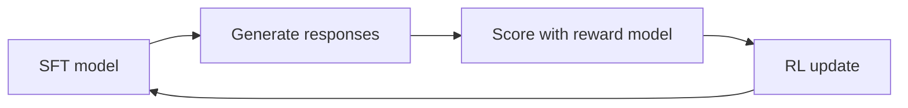

# 7 · Reinforcement Learning Post-Training

## Why RL after SFT

SFT teaches the model to imitate the responses in the training dataset. But imitation has limits:

- **Distribution shift** — the model sees the gold response, not the distribution of responses it would generate
- **No preference signal** — SFT doesn't distinguish between a good and a mediocre response in the training data
- **Sycophancy** — imitation learning can reward responses that sound good rather than responses that are correct

Reinforcement learning from human feedback (RLHF) addresses this by directly optimising for a reward signal — either from human raters or a trained reward model. This is how ChatGPT, Claude, and Llama-3-Instruct achieve their alignment properties.

## The RL pipeline



## Offline vs. online RL

| Mode | How it works | When to use |
|---|---|---|
| **Offline (DPO, GRPO)** | Train on a static dataset of preferences (chosen vs. rejected pairs) | Simpler; no rollout infrastructure; good starting point |
| **Online (PPO)** | Generate responses during training; score them; update immediately | More powerful; requires actor-critic infrastructure and a live reward model |

## Offline RL: TRL

We use TRL for offline RL methods:

### DPO (Direct Preference Optimization)

DPO bypasses the reward model entirely by directly training on preference pairs. Given a prompt with a "chosen" and "rejected" response, DPO increases the probability of the chosen response relative to the rejected one:

```python
from trl import DPOTrainer, DPOConfig

trainer = DPOTrainer(
    model=model,
    args=DPOConfig(...),
    train_dataset=preference_dataset,  # needs "prompt", "chosen", "rejected" columns
)
```

**Dataset:** [Anthropic/hh-rlhf](https://huggingface.co/datasets/Anthropic/hh-rlhf) or similar preference datasets.

### GRPO (Group Relative Policy Optimization)

GRPO generates multiple responses per prompt, scores them with a reward function, and trains the model to prefer higher-scoring responses relative to the group average. This avoids the need for a separate reward model.

```python
from trl import GRPOTrainer, GRPOConfig

def reward_fn(responses, prompts):
    # Score each response — e.g., length, format compliance, factual correctness
    return scores

trainer = GRPOTrainer(
    model=model,
    reward_funcs=reward_fn,
    args=GRPOConfig(...),
    train_dataset=prompt_dataset,
)
```

## Online RL: OpenRLHF

For online PPO, we use [OpenRLHF](https://github.com/OpenRLHF/OpenRLHF) rather than TRL. TRL's PPO implementation is not production-grade for actor-critic rollout loops — it lacks the distributed rollout buffer and reward model integration needed for stable training at scale.

OpenRLHF provides:
- Distributed rollout with vLLM for fast generation
- Reward model serving
- Reference model (frozen SFT model for KL penalty)
- Critic network
- PPO update with clipping

```
Actor (policy, trainable)
    → generate responses
    → reward model scores them
    → KL penalty from reference model
    → PPO clipped objective
    → update actor + critic
```

## Reward modelling

A reward model is a classifier trained on human preference data to predict which of two responses a human would prefer. It provides the scalar reward signal for PPO.

Training a reward model requires:
1. A preference dataset (prompt + chosen + rejected response pairs)
2. The SFT model as a backbone
3. A scalar head replacing the LM head

The reward model is kept frozen during RL training.

## Status

RL post-training is planned for after pre-training and SFT are validated. The framework choices (TRL for offline, OpenRLHF for online) are decided; implementation will follow.
