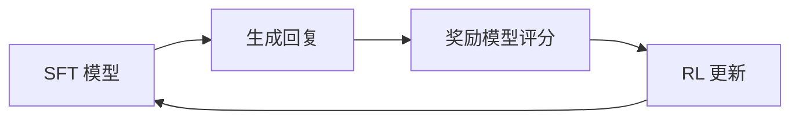

# 7 · 强化学习后训练

## 为什么 SFT 之后需要 RL

SFT 教会模型模仿训练数据集中的回复，但模仿存在局限：

- **分布偏移** —— 模型看到的是黄金回复，而非其自身会生成的回复分布
- **缺乏偏好信号** —— SFT 无法区分训练数据中好的回复与平庸的回复
- **讨好倾向** —— 模仿学习可能奖励听起来不错的回复，而非实际正确的回复

基于人类反馈的强化学习（RLHF）通过直接优化奖励信号来解决这些问题 —— 奖励来自人工评估者或训练好的奖励模型。ChatGPT、Claude 和 Llama-3-Instruct 的对齐特性正是通过这种方式实现的。

## RL 流水线



## 离线 RL 与在线 RL

| 模式 | 工作方式 | 适用场景 |
|---|---|---|
| **离线（DPO、GRPO）** | 在静态偏好数据集（好/坏样本对）上训练 | 更简单；无需 Rollout 基础设施；适合起步 |
| **在线（PPO）** | 训练中实时生成回复并评分更新 | 更强大；需要 Actor-Critic 基础设施和实时奖励模型 |

## 离线 RL：TRL

我们使用 TRL 实现离线 RL 方法：

### DPO（直接偏好优化）

DPO 完全绕过奖励模型，直接在偏好对上训练。给定包含"好回复"和"坏回复"的提示词，DPO 提高好回复相对坏回复的概率：

```python
from trl import DPOTrainer, DPOConfig

trainer = DPOTrainer(
    model=model,
    args=DPOConfig(...),
    train_dataset=preference_dataset,  # 需要 "prompt"、"chosen"、"rejected" 列
)
```

**数据集：** [Anthropic/hh-rlhf](https://huggingface.co/datasets/Anthropic/hh-rlhf) 或类似偏好数据集。

### GRPO（组相对策略优化）

GRPO 对每个提示词生成多个回复，用奖励函数评分，训练模型优先输出高分回复（相对于组内平均值）。无需单独的奖励模型。

```python
from trl import GRPOTrainer, GRPOConfig

def reward_fn(responses, prompts):
    # 对每个回复评分 —— 如长度、格式合规性、事实正确性
    return scores

trainer = GRPOTrainer(
    model=model,
    reward_funcs=reward_fn,
    args=GRPOConfig(...),
    train_dataset=prompt_dataset,
)
```

## 在线 RL：OpenRLHF

对于在线 PPO，我们使用 [OpenRLHF](https://github.com/OpenRLHF/OpenRLHF) 而非 TRL。TRL 的 PPO 实现对于 Actor-Critic Rollout 循环而言并非生产级 —— 它缺乏大规模稳定训练所需的分布式 Rollout 缓冲区和奖励模型集成。

OpenRLHF 提供：
- 使用 vLLM 进行快速生成的分布式 Rollout
- 奖励模型服务
- 参考模型（冻结的 SFT 模型，用于 KL 惩罚）
- Critic 网络
- 带裁剪的 PPO 更新

```
Actor（策略，可训练）
    → 生成回复
    → 奖励模型评分
    → 参考模型 KL 惩罚
    → PPO 裁剪目标
    → 更新 Actor + Critic
```

## 奖励建模

奖励模型是在人类偏好数据上训练的分类器，用于预测人类更倾向于哪个回复。它为 PPO 提供标量奖励信号。

训练奖励模型需要：
1. 偏好数据集（提示词 + 好回复 + 坏回复对）
2. 以 SFT 模型为骨干
3. 用标量头替换语言模型头

奖励模型在 RL 训练期间保持冻结。

## 当前状态

RL 后训练计划在预训练和 SFT 验证之后进行。框架选择已确定（离线用 TRL，在线用 OpenRLHF）；实现工作将随后展开。
